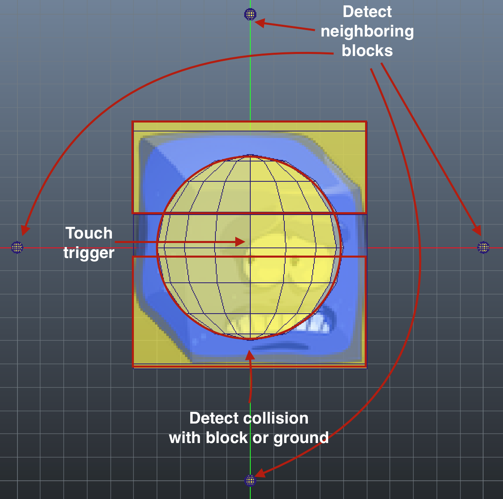

## Introduction ##
This example project shows a simple Linker and Switcher game. The main purpose of this example was to see if it was possible to create a grid based game such as a linker or switcher without a central data model to keep track of which block is in which cell in the grid.

Despite the ambition of getting rid of a grid like data structure the games are not completely without a central data model. When blocks are spawned from the top of the screen their ids are stored in an array and when blocks are removed their ids are removed from the same array. Keeping track of a single list of blocks is a decent enough tradeoff since it is a lot more manageable than a grid-like data structure that must be kept up to date as blocks are falling, spawning and being removed.

## Physics based system ##
The linker and switcher uses the Defold physics system to detect when a block should fall, when it is touched by a user and what neigboring blocks it has.

Each block has a collision component at the bottom and the top of the block. These are used to determine if a block should fall or not. The collision component at the bottom will detect collisions with the top collision component of any block that happens to be below it. The same collision component is also used to detect collisions with the ground. If no collision occurs the block will fall, otherwise it will stop.

The blocks also have a central collision component that is used to detect touch events. When the mouse or a touch event occurs a small cursor collision component will follow the touch event's x and y and collide with the collision component of the block.

Finally the blocks have four small collision components above, below, left and right of the block to detect neighboring blocks. Each block has a property per cardinal direction to hold the id of neighboring blocks and these properties will be updated when collisions with neighboring blocks occur. This information is used in the switcher to detect groups of blocks in the same color.

[Play the game in your browser](https://britzl.github.io/linkandswitch/)
